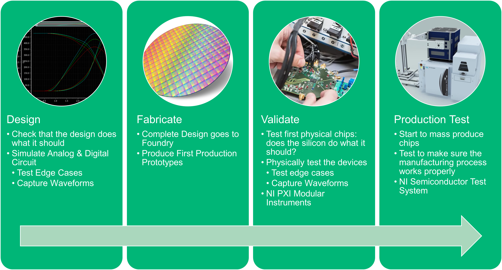

# Waveform Images: Machine Learning
This repo is for the colaboration betwen [NI's Semiconductor and Electronic's](https://www.ni.com/en-us/solutions/semiconductor.html) Systems R&D team and the [BYU Colege of Physical and Mathematical Sciences](https://science.byu.edu/) Capstone projects. 

# Project Overview

## Introduction

NI’s Semiconductor and Electronics Business Unit is working on a suite of products that enables Electrical Engineers working on semiconductor products to easily find and visualize their data across design, validation, and production test. 

Here is a video of one of my team members discussing the vision for the space we’re talking about: [Bridge Semiconductor Design to Test through a Data Platform - YouTube](https://www.youtube.com/watch?v=umfbQ3IY3fU&ab_channel=NI)

An important part of this workflow is that design and validation engineers need to be able to find, visualize, and analyze waveforms.

### Waveform
> A set of data series with a single independent and multiple dependent variables. Typically, the independent variable (x) is time (0ns – 10ns, step 1ps) but may also be a sweep of electrical frequencies (ex. 1MHz – 100MHz, step .1MHz), or a sweep of voltage, current, or another electrical characteristic. Waveforms typically have 100,000 to 10,000,000 points per variable.

Waveforms are often captured as raw numerical results; however, they are often also captured as screen captures or images of traces from an instrument or simulation program. 

## Project Vision
Create a AI/ML approach to classifying images of waveform data

1. Group similar waveforms.
2. Tag images of waveforms that require further analysis due to anomalies.
3. Highlight image regions that are possibly errors.

# Getting Started
After cloning the repo, do the following.
1. run `pip install -r requirements.txt` to install required python packages
2. run `python RandomWaveform.py` to generate a set of waveform images
